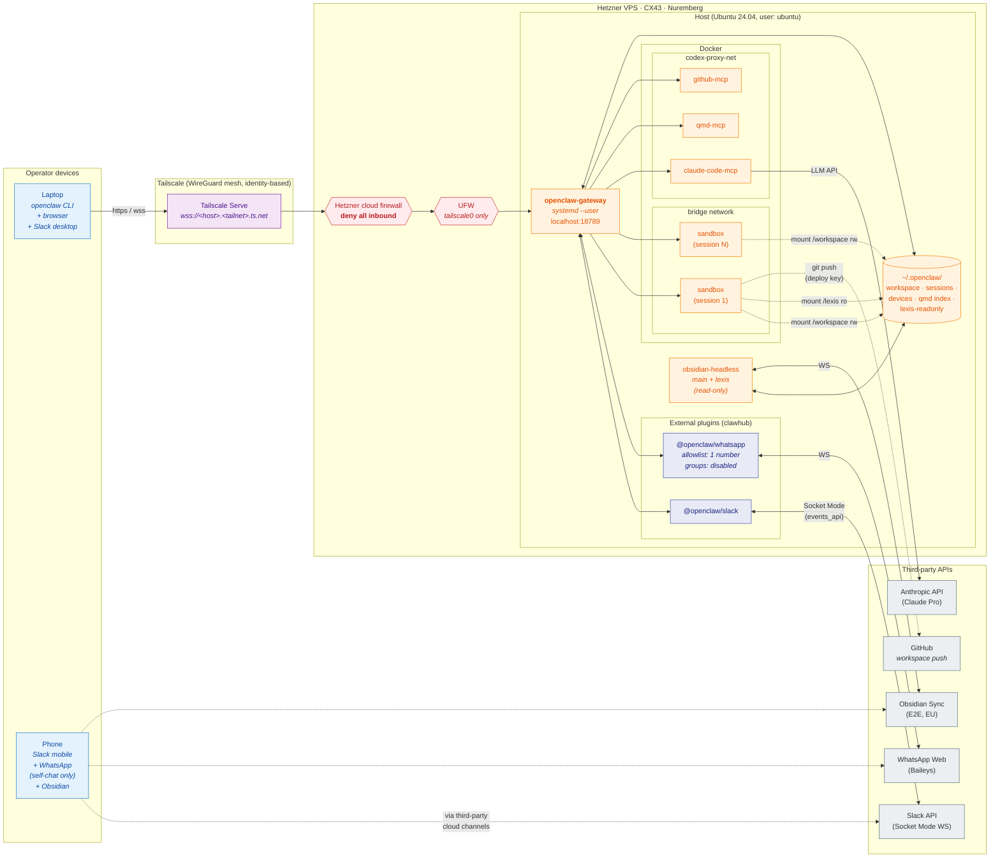
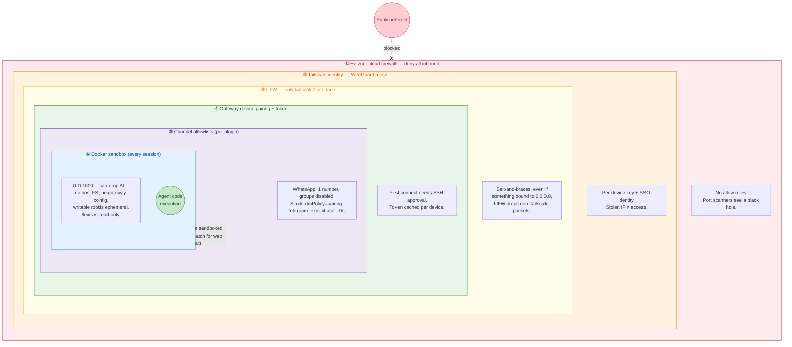
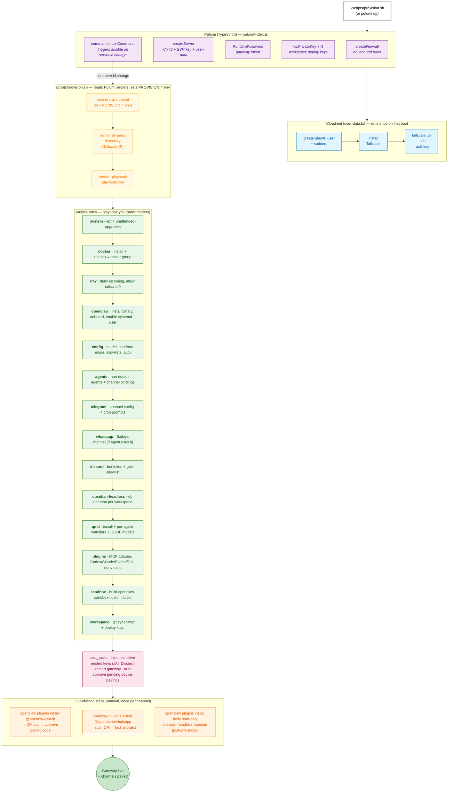
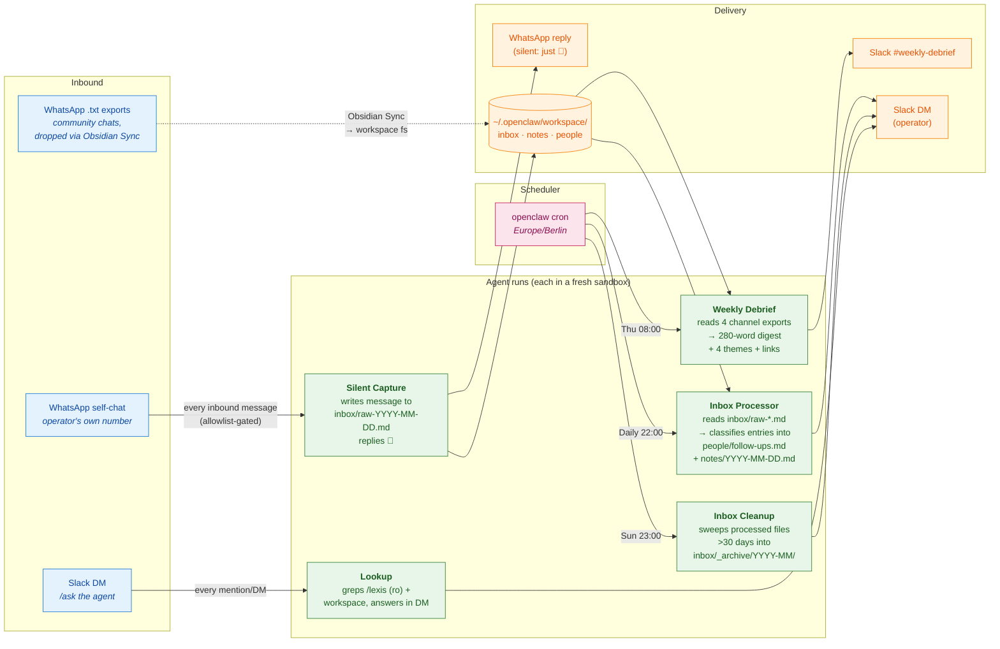

# OpenClaw Deployment — Architecture

> Visual reference for a personal OpenClaw deployment on Hetzner Cloud + Tailscale.
> Describes a single-agent, Slack-primary configuration with WhatsApp self-chat capture,
> a read-only second-brain mirror, and three production workflows.

| # | Diagram | Answers |
|---|---|---|
| 1 | [System architecture](#1-system-architecture) | What talks to what? |
| 2 | [Defense in depth](#2-defense-in-depth) | Why is this safe to put on the public internet? |
| 3 | [Provisioning flow](#3-provisioning-flow) | What happens when `pulumi up` runs? |
| 4 | [Working workflows](#4-working-workflows) | What does the agent actually do day-to-day? |

Source of truth: `pulumi/index.ts`, `ansible/playbook.yml`, and the runtime config on the VPS (`~/.openclaw/openclaw.json`). When the diagrams drift from those, the code wins — update both in the same PR.

**Deployment snapshot:** OpenClaw `2026.5.22` · agent backend `@anthropic-ai/claude-code@2.1.97` (Claude Pro) · single agent (`main`) · Hetzner CX43 in Nuremberg · `@openclaw/slack` + `@openclaw/whatsapp` external plugins from clawhub.

---

## 1. System architecture

**What talks to what.** Every client path enters through Tailscale; nothing is reachable on the public internet. Inside the VPS, the gateway runs as a user-level systemd service on `localhost:18789` and is exposed to the tailnet via Tailscale Serve. Sessions run as Docker containers on a bridge network with two volume mounts: the agent's workspace (`/workspace`, read-write) and a pull-only mirror of an external knowledge vault (`/lexis`, read-only). MCP server containers sit on a separate `codex-proxy-net` so sandbox containers can't reach the credential proxy.

The primary control channel is **Slack** (Socket Mode via the external `@openclaw/slack` plugin). **WhatsApp** is present but locked to self-chat only: the operator's own number is the sole entry on the DM allowlist; all groups are disabled. Bulk community content enters as static `.txt` exports dropped into the workspace via Obsidian Sync, not over the WhatsApp channel.



**Key invariants:**

- No inbound public ports. The Hetzner firewall has no allow rules.
- The gateway binds `127.0.0.1:18789`; Tailscale Serve is the only proxy.
- Sandbox containers can reach the open internet (for `git push`, web fetch) but **cannot** reach `codex-proxy-net`.
- The `/lexis` mount is bind-mounted **read-only**; the sandbox cannot modify the second-brain vault.
- WhatsApp is the highest-blast-radius channel and is locked at the plugin layer: only the operator's own phone number can deliver a message; all groups are disabled.
- Bulk content from third-party chat groups enters the system as **static file exports**, not via live channel integration.

---

## 2. Defense in depth

**Why putting this on the public internet is fine.** Six independent layers stand between the open internet and any code execution. Each layer fails closed; defeating one does not yield meaningful capability on its own.



**Trust boundaries (outside → in):**

| Layer | What it stops | What still passes |
|---|---|---|
| ① Hetzner FW | All unsolicited inbound TCP/UDP. | Outbound: anywhere. |
| ② Tailscale | Anyone not on the operator's tailnet. | Identified tailnet peers. |
| ③ UFW | Packets from a non-`tailscale0` interface that somehow arrived. | Tailscale traffic. |
| ④ Pairing | Authenticated tailnet peers not on the approve-list. | Approved devices holding the token. |
| ⑤ Channel allowlists | Inbound messages from senders outside the per-channel allowlist (different per channel — WhatsApp is tightest). | Allowlisted senders. |
| ⑥ Sandbox | Sandbox → host FS, sandbox → MCP proxy net, privilege escalation, persistent rootfs writes, writes to `/lexis`. | `/workspace` r/w; `/lexis` r/o; outbound internet via Docker NAT. |

Layer ⑤ is deployment-specific — the channel allowlists encode operator intent (which humans/rooms can address the agent). Other layers are mechanical.

See [SECURITY.md](./SECURITY.md) for the full threat model and writable-rootfs rationale.

---

## 3. Provisioning flow

**What happens when `pulumi up` runs.** Pulumi creates infra, cloud-init does a 3-line bootstrap, then Pulumi triggers `scripts/provision.sh`, which hands off to Ansible. Each Ansible role has a tag; day-2 changes re-run individual roles via `./scripts/provision.sh --tags <tag>`.

Channels that live as external plugins (`@openclaw/slack`, `@openclaw/whatsapp`) are installed via `openclaw plugins install` after the `plugins` role and paired interactively the first time (Slack: pairing code via DM; WhatsApp: QR scan).



**Why the order matters (not arbitrary):**

- `docker` before `ufw` — the docker install touches iptables; UFW after means UFW wins where they conflict.
- `openclaw` → `config` → `agents` → `telegram` — agents must exist before any channel can bind chat IDs to them; if `sandbox` ran in between, messages would briefly misroute.
- `qmd` before `plugins` — the plugins role registers `qmd-<agent>` MCP servers and requires the qmd binary to exist.
- `sandbox` near the end — the image build is the slowest step (~minutes); failing earlier roles fail fast.
- `workspace` last — only needed if Pulumi has `workspace*RepoUrl` set; runs git sync timer setup once everything to back up exists.

External plugins are deliberately **not** in Ansible: their pairing step is interactive (Slack pairing code in a DM; WhatsApp QR scan with a 60-second window) and re-running an automation through them risks de-pairing a working channel.

**Day-2 operations** use the same playbook with `--tags`:

```bash
./scripts/provision.sh --tags config           # change model / allowlist / auth
./scripts/provision.sh --tags telegram         # update cron prompts
./scripts/provision.sh --tags sandbox -e force_sandbox_rebuild=true
./scripts/provision.sh --check --diff          # dry run
```

---

## 4. Working workflows

**What the agent actually does day-to-day.** Three production workflows are wired through the gateway. Each has a different inbound trigger, runs the same agent inside the same sandbox, and delivers to a different destination.



**Workflow summary:**

| Workflow | Trigger | Reads | Writes |
|---|---|---|---|
| Weekly Debrief | Cron · Thu 08:00 | `workspace/WhatsApp History/*.txt` (4 channel exports) | Slack `#weekly-debrief` |
| Inbox Processor | Cron · daily 22:00 | `workspace/inbox/raw-*.md` | `workspace/people/follow-ups.md`, `workspace/notes/YYYY-MM-DD.md`, Slack DM summary |
| Inbox Cleanup | Cron · Sun 23:00 | processed `inbox/raw-*.md` &gt;30 days old | `workspace/inbox/_archive/YYYY-MM/`, Slack DM summary |
| Silent Capture | WhatsApp self-chat message | (nothing — direct file write) | `workspace/inbox/raw-YYYY-MM-DD.md` + 📝 reply |
| Lookup | Slack DM / mention | `/workspace` (r/w) + `/lexis` (r/o) | Slack reply |

**Design notes:**

- **Bulk community content does not flow through the WhatsApp channel.** Static `.txt` exports are dropped via Obsidian Sync into the workspace filesystem and consumed there. The WhatsApp channel itself stays locked to a single sender (the operator's own number). This sidesteps Baileys reliability problems and platform ToS risk.
- **Silent Capture costs ~6 seconds of agent compute per inbound self-chat message** because every inbound triggers a full agent turn (even though the agent only emits 📝). For higher-volume capture this would warrant a custom plugin that writes to file without spinning up the agent.
- **Two Obsidian Sync daemons run on the host**: one bidirectional for the agent's workspace, one **pull-only** for the operator's external knowledge vault (`lexis-readonly`). The pull-only daemon ensures the agent can never write back into the external vault, even if a sandbox is compromised — the mount is read-only at the Docker layer **and** the daemon refuses uploads at the application layer.
- **The Slack adapter converts standard Markdown to Slack mrkdwn** for the operator. Cron prompts emit standard `**bold**` / `*italic*` / `[label](url)`, not Slack mrkdwn syntax.

---

## Updating these diagrams

When the deployment changes:

- New channel → add a node to diagram 1 under "Third-party APIs" with the protocol on the edge; if it introduces a new allowlist surface, update diagram 2's layer ⑤ table.
- New cron job or workflow → add a row to diagram 4's table and a swimlane to the flow.
- New Ansible role → add a node to diagram 3, mention ordering rationale if non-trivial.

Render with any Mermaid preview (VS Code extension, GitHub renders inline). Keep the source readable — diff quality matters more than visual perfection.
